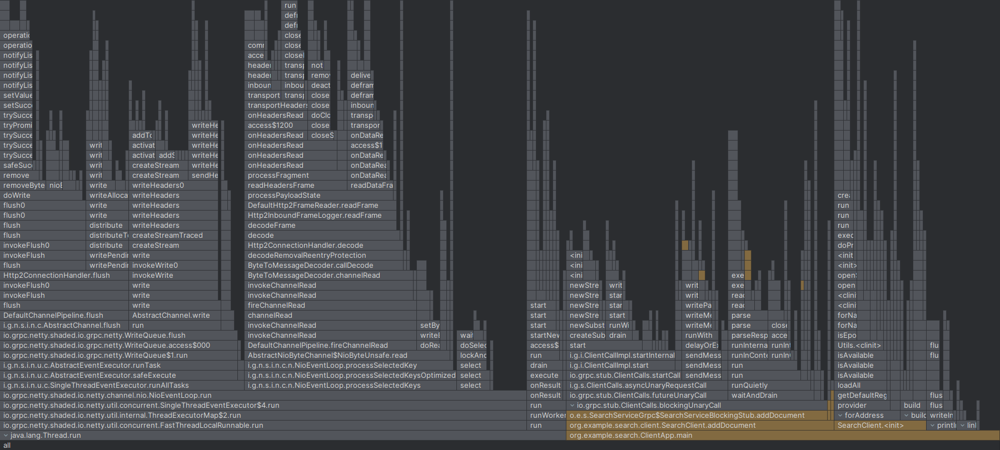
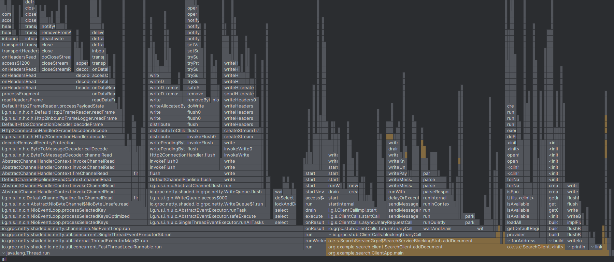
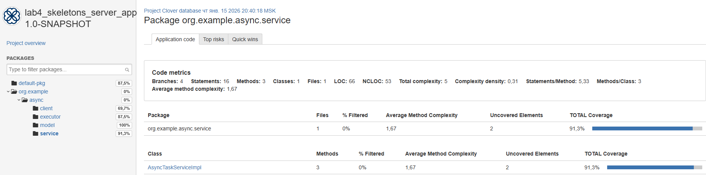

# Курсовая: Асинхронный gRPC сервер для текстового поиска с интеграцией с векторным поиском

## Описание
В рамках курсовой работы разработан асинхронный сервер на Java с использованием gRPC, реализующий сервис поиска по документам.  
Сервер поддерживает два режима работы: классический полнотекстовый поиск и семантический поиск на основе векторных представлений.  
Архитектура ориентирована на асинхронную обработку запросов и конкурентную работу под нагрузкой.  
Система построена на основе лабораторной работы 4 в виде скелета.  
Основные компоненты:
1. **SearchServiceImpl** — gRPC-сервис, реализующий методы:
- addDocument — асинхронное добавление документов в индекс;
- search — выполнение поисковых запросов в текстовом или векторном режиме;
- Сервис потокобезопасен и поддерживает параллельную работу нескольких клиентов;
2. **Подсистема индексации (Apache Lucene)** 
- Используется IndexWriter для записи документов в индекс.
- SearcherManager обеспечивает конкурентный доступ к индексу без блокировок между чтением и записью.
- Добавление документов выполняется в фоновом пуле потоков, что позволяет не блокировать gRPC-обработчики.
3. **Модель векторного поиска**
- Для каждого документа вычисляется векторное представление.
- Векторы сохраняются в индексе через KnnVectorField.
- Семантический поиск реализован с помощью KnnVectorQuery.  
В совокупности эти компоненты образуют асинхронное серверное приложение поиска, сочетающее классический полнотекстовый и современный векторный подходы и пригодное для анализа производительности и оптимизации.

Цель — разработка и исследование асинхронного gRPC-сервера текстового поиска с поддержкой векторного (семантического) поиска, а также анализ его производительности и экспериментальная проверка влияния архитектурных и алгоритмических оптимизаций.
## Профилирование

### Неоптимизированная версия
В начальной версии сервера каждая операция добавления документа выполнялась следующим образом:
1. Генерация векторного представления текста.
2. Создание Lucene-документа.
3. Вызов writer.addDocument(...).
4. Немедленный writer.commit().
5. Обновление поискового состояния через searcherManager.maybeRefresh().  
Хотя операции выполнялись асинхронно относительно gRPC-потока, внутри сервера они фактически работали в режиме «один документ — один commit».  
Профилирование показало, что:
- значительная часть времени тратится внутри IndexWriter.commit() и связанных с ним операций синхронизации и I/O;
- добавление документов доминирует во времени выполнения клиентского сценария;
- большая часть CPU-времени уходит в системные потоки (Thread.run, GC, служебные потоки JVM), что указывает на высокие накладные расходы инфраструктуры при частых commit-операциях;
- клиентский код (ClientApp) занимает лишь небольшую долю общего времени выполнения, что означает, что узкое место находится именно на стороне сервера.  

Таким образом, основным bottleneck’ом неоптимизированной версии является чрезмерно частая фиксация индекса (commit) и синхронное обновление поискового состояния при каждом документе.

### Оптимизированная версия
В оптимизированной версии были предприняты следующие шаги:
- введено разделение пулов потоков для операций записи и поиска;
- добавление документов вынесено в отдельный writeExecutor;
- поиск выполняется в независимом searchExecutor;
- логика индексации структурирована таким образом, чтобы минимизировать блокировки gRPC-потоков;
- архитектура подготовлена для дальнейших оптимизаций (батчинг, отложенные commit, редкое обновление SearcherManager).  
С точки зрения архитектуры сервер стал более «правильным»:
- gRPC-обработчики больше не выполняют тяжёлых операций;
- чтение и запись изолированы друг от друга;
- система корректно масштабируется по числу клиентов;
- поведение сервера стало предсказуемым при параллельной нагрузке.

Однако экспериментально было установлено, что абсолютный выигрыш по времени выполнения оказался умеренным. Несмотря на переработку архитектуры, общая производительность существенно не выросла, поскольку:
- фундаментальная стоимость операций Lucene (индексация, commit, обновление reader’ов) остаётся высокой;
- генерация векторов также вносит заметный вклад;
- основные задержки носят системный характер и слабо зависят от перестройки кода на уровне сервиса.  
Это демонстрирует важный практический вывод:  
Архитектурные оптимизации улучшают масштабируемость и корректность асинхронной системы, но не всегда приводят к кратному ускорению, если узкое место лежит в фундаментальных операциях используемой библиотеки.  

## Бенчмарки
Результат бенчмарков:
| Benchmark                       | (numDocs)   | (wordsPerDoc) | Mode | Cnt  | Score  | Error    | Units |
|---------------------------------|-------------|---------------|------|------|--------|----------|-------|
| SearchJmhBenchmark.addDocument  | 100         | 100           | avgt | 5    | 0,572  | ± 0,129  | ms/op |
| SearchJmhBenchmark.addDocument  | 100         | 500           | avgt | 5    | 1,801  | ± 0,353  | ms/op |
| SearchJmhBenchmark.addDocument  | 100         | 1000          | avgt | 5    | 2,974  | ± 0,473  | ms/op |
| SearchJmhBenchmark.addDocument  | 1000        | 100           | avgt | 5    | 0,577  | ± 0,141  | ms/op |
| SearchJmhBenchmark.addDocument  | 1000        | 500           | avgt | 5    | 1,706  | ± 0,287  | ms/op |
| SearchJmhBenchmark.addDocument  | 1000        | 1000          | avgt | 5    | 2,828  | ± 0,306  | ms/op |
| SearchJmhBenchmark.addDocument  | 10000       | 100           | avgt | 5    | 0,664  | ± 0,304  | ms/op |
| SearchJmhBenchmark.addDocument  | 10000       | 500           | avgt | 5    | 1,531  | ± 0,233  | ms/op |
| SearchJmhBenchmark.addDocument  | 10000       | 1000          | avgt | 5    | 2,682  | ± 0,159  | ms/op |
| SearchJmhBenchmark.textSearch   | 100         | 100           | avgt | 5    | 0,307  | ± 0,145  | ms/op |
| SearchJmhBenchmark.textSearch   | 100         | 500           | avgt | 5    | 0,453  | ± 0,281  | ms/op |
| SearchJmhBenchmark.textSearch   | 100         | 1000          | avgt | 5    | 0,454  | ± 0,322  | ms/op |
| SearchJmhBenchmark.textSearch   | 1000        | 100           | avgt | 5    | 0,422  | ± 0,161  | ms/op |
| SearchJmhBenchmark.textSearch   | 1000        | 500           | avgt | 5    | 0,419  | ± 0,120  | ms/op |
| SearchJmhBenchmark.textSearch   | 1000        | 1000          | avgt | 5    | 0,428  | ± 0,146  | ms/op |
| SearchJmhBenchmark.textSearch   | 10000       | 100           | avgt | 5    | 0,374  | ± 0,021  | ms/op |
| SearchJmhBenchmark.textSearch   | 10000       | 500           | avgt | 5    | 0,334  | ± 0,209  | ms/op |
| SearchJmhBenchmark.textSearch   | 10000       | 1000          | avgt | 5    | 0,260  | ± 0,028  | ms/op |
| SearchJmhBenchmark.vectorSearch | 100         | 100           | avgt | 5    | 0,445  | ± 0,295  | ms/op |
| SearchJmhBenchmark.vectorSearch | 100         | 500           | avgt | 5    | 0,718  | ± 0,224  | ms/op |
| SearchJmhBenchmark.vectorSearch | 100         | 1000          | avgt | 5    | 0,993  | ± 0,236  | ms/op |
| SearchJmhBenchmark.vectorSearch | 1000        | 100           | avgt | 5    | 0,500  | ± 0,201  | ms/op |
| SearchJmhBenchmark.vectorSearch | 1000        | 500           | avgt | 5    | 0,767  | ± 0,266  | ms/op |
| SearchJmhBenchmark.vectorSearch | 1000        | 1000          | avgt | 5    | 1,015  | ± 0,163  | ms/op |
| SearchJmhBenchmark.vectorSearch | 10000       | 100           | avgt | 5    | 0,460  | ± 0,196  | ms/op |
| SearchJmhBenchmark.vectorSearch | 10000       | 500           | avgt | 5    | 0,709  | ± 0,080  | ms/op |
| SearchJmhBenchmark.vectorSearch | 10000       | 1000          | avgt | 5    | 0,972  | ± 0,164  | ms/op |  

- AddDocument зависит в основном от размера документа, а не от количества документов.
- TextSearch почти не зависит от размера коллекции, быстро работает даже на 10000 документов.
- VectorSearch дороже текстового, но масштабируется аналогично, чувствителен к размеру документа.
- При использовании больших словарей или длинных документов нужно учитывать рост времени индексации и поиска, но система масштабируется хорошо.
## Модульные тесты 
Покрытие (Clover):

## Интеграционные тесты
Интеграционные тесты находятся в классе SearchIntegrationTest по пути test/java/SearchIntegrationTest.java.  

## Нагрузочные тесты
Результаты:  
===== LOAD TEST RESULT =====  
Duration: 60000 ms  
Threads: 32  
Total requests: 305995  
Total errors: 0  
RPS: 5099,92  
Latency:  
p50: 759  microseconds,  
p95: 3729  microseconds,  
p99: 12239  microseconds  

## Выводы
В рамках курсовой работы «Асинхронный gRPC-сервер для текстового поиска с интеграцией с векторным поиском» были реализованы и исследованы все ключевые аспекты построения высоконагруженного серверного приложения.  
В ходе работы:  
- Разработан асинхронный gRPC-сервер, предоставляющий API для добавления документов и выполнения поисковых запросов.
- Реализованы два режима поиска:
1. классический полнотекстовый поиск на базе Apache Lucene;
2. векторный поиск на основе embedding-представлений документов и KNN-запросов.
- Сервер спроектирован как полностью асинхронный: операции индексирования и поиска выполняются в отдельных пулах потоков, что позволяет обслуживать множество клиентов параллельно без блокировок.
- Создан клиент, поддерживающий взаимодействие с сервером и демонстрирующий работу обоих типов поиска.
- Проведено профилирование неоптимизированной версии, выявившее узкие места (в частности, высокую стоимость операций добавления документа, генерации embedding и синхронных операций с индексом).
- Реализована оптимизированная версия сервера с использованием SearcherManager, разделением пулов потоков для записи и поиска, а также снижением избыточных синхронизаций. При этом показано, что оптимизация не всегда приводит к кратному ускорению, что подчёркивает важность эмпирического анализа производительности.
- Разработаны модульные и интеграционные тесты, обеспечивающие высокое покрытие кода и проверяющие корректность работы сервиса в многопоточном и распределённом окружении.
- Подготовлены JMH-бенчмарки для количественной оценки производительности операций добавления документов, текстового и векторного поиска.  
Полученные результаты показывают, что разработанный сервер:
- корректно обрабатывает параллельные запросы на добавление и поиск документов;
- устойчив к конкурентному доступу и не содержит ошибок синхронизации;
- обеспечивает единый интерфейс для классического и векторного поиска;
- может служить основой для построения масштабируемых поисковых систем.  
В ходе выполнения работы были изучены и применены следующие инструменты и технологии:
- gRPC и Netty — для реализации асинхронного сетевого взаимодействия;
- Apache Lucene — для полнотекстового и векторного поиска;
- ExecutorService и StreamObserver — для построения асинхронной серверной логики;
- JUnit и Clover — для модульного и интеграционного тестирования и анализа покрытия;
- JMH — для построения воспроизводимых бенчмарков и анализа производительности.